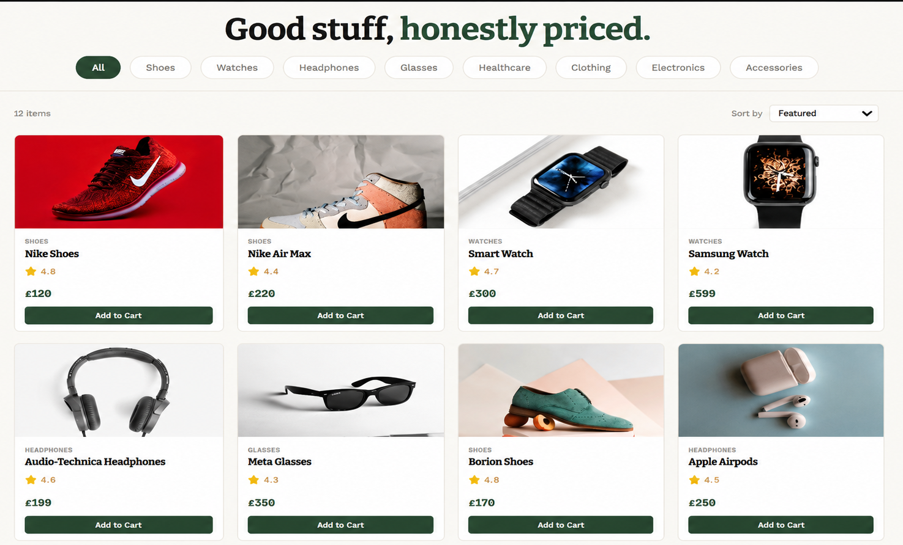

# Ecommerce App

A modern ecommerce frontend built with React featuring products browsing, category filtering, shopping cart functionality, and a responsive user interface.

##  Live Demo

🔗 https://adilecommerceapp.netlify.app/

---

##  Preview



---

##  Features

- Product listing
- Shopping cart
- Add & remove items
- Quantity management
- Responsive design
- Modern UI
- React Context API
- Fast performance

---

##  Built With

- React
- JavaScript (ES6+)
- CSS3
- HTML5
- Vite

---

## 📂 Project Structure

```text
ecommerce-app/
│
├── src/
├── assets/
├── index.html
├── package.json
├── vite.config.js
└── README.md
```

---

##  Responsive Design

Optimized for

- Desktop
- Laptop
- Tablet
- Mobile

---

##  Contact

If you'd like to collaborate, feel free to reach out.

- Email: adilishtiaq034mail.com

---

## 📄 License

This project is licensed under the MIT License.

---

### Developed & Designed by Adil Ishtiaq
